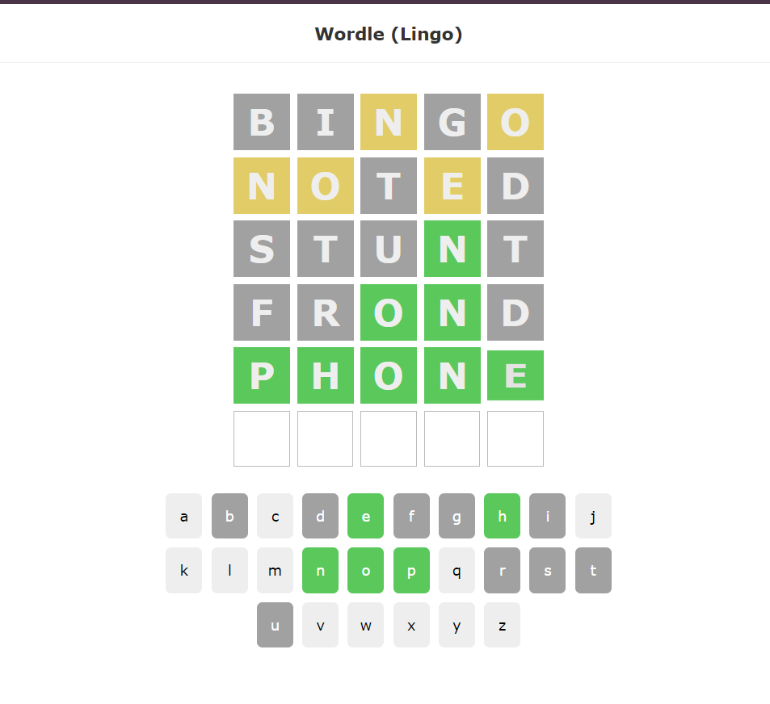

# Wordle Game App



This project was created using [Create React App](https://github.com/facebook/create-react-app).

## Available Scripts

In the project directory, you can run:

### `npm install`

Installs the necessary packages from `package.json`.

### `npm start`

Runs the app in development mode.\
Open [http://localhost:3000](http://localhost:3000) to view it in your browser.

The page will reload when you make changes.\
You may also see any lint errors in the console.

## Data

To fetch data, use the following command:

```sh
json-server ./data/db.json --port 3001
```
